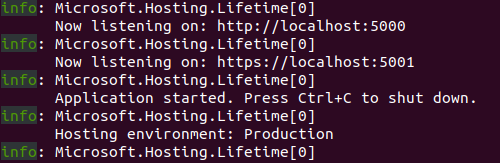
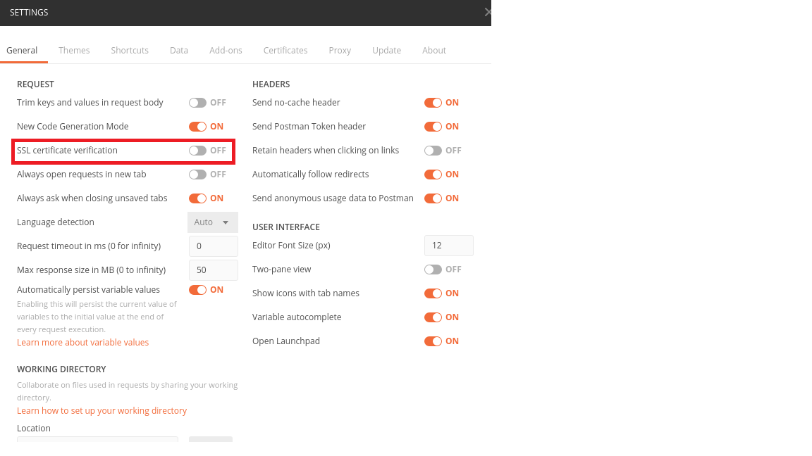
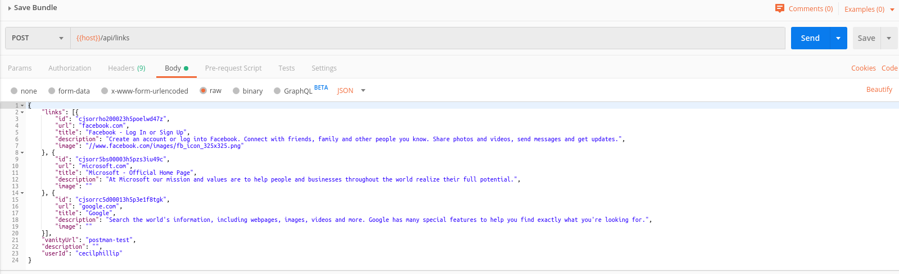
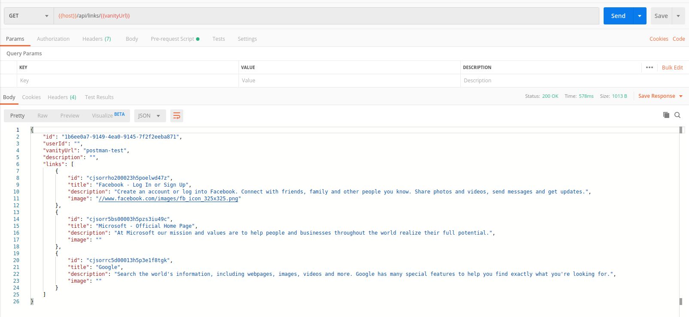
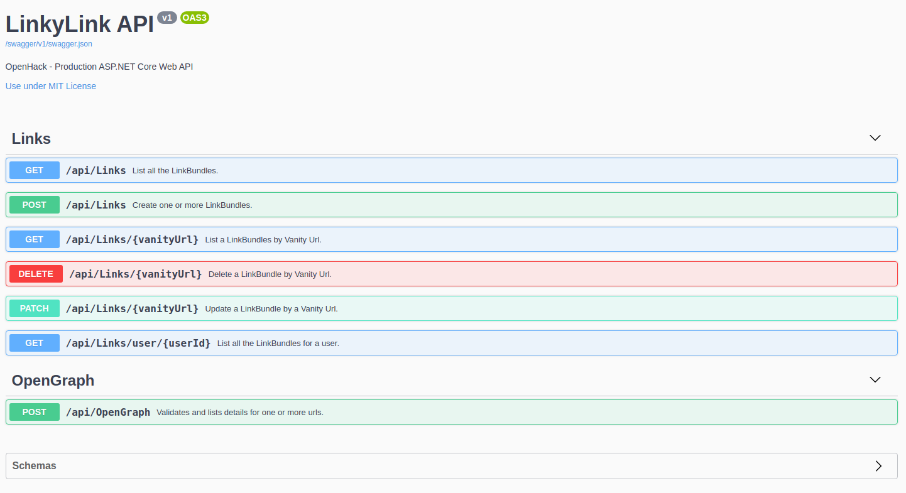

# The Urlist - Backend

[](https://burkeknowswords.visualstudio.com/The%20Urlist/_build/latest?definitionId=8)
[](https://raw.githubusercontent.com/Azure-Samples/openhack-production/master/LICENSE)

<<<<<<< HEAD
The backend for this project was built as a .Net Core API using .NET Core. All the data is stored in a Cosmos DB collection using the SQL API.

- [.NET Core](https://dotnet.microsoft.com?WT.mc_id=theurlist-github-cephilli)
=======
The backend for this project was built as a .Net Core API using .NET Core 3.1. All the data is stored in a Cosmos DB collection using the SQL API.

- [.NET Core 3.1](https://dotnet.microsoft.com?WT.mc_id=theurlist-github-cephilli)
>>>>>>> Updates to API README.md file
- [Azure Cosmos DB](https://azure.microsoft.com/services/cosmos-db?WT.mc_id=theurlist-github-cephilli)

## Build and run the backend locally

### Get the prerequisites

<<<<<<< HEAD
- Install the [.NET Core 3.1 SDK](https://dotnet.microsoft.com/download?WT.mc_id=theurlist-github-cephilli). This repo is pinned to use version 3.1.x of the SDK.
=======
- Install the [.NET Core SDK](https://dotnet.microsoft.com/download?WT.mc_id=theurlist-github-cephilli). This repo is pinned to use version 3.1.x of the SDK.
>>>>>>> Updates to API README.md file
- Install [Visual Studio](https://visualstudio.microsoft.com/) or [Visual Studio Code](https://code.visualstudio.com/?WT.mc_id=theurlist-github-cephilli) or [Visual Studio Community edition](https://visualstudio.microsoft.com/vs?WT.mc_id=theurlist-github-cephilli)
- Install the [C# extension for Visual Studio Code](https://marketplace.visualstudio.com/items?itemName=ms-vscode.csharp&WT.mc_id=theurlist-github-cephilli)

#### Optional

- Install [Postman](https://www.getpostman.com/)

### Run the ASP.Net Core Web API backend

Navigate into backend folder

```bash
cd /api/src/LinkyLink
```

Build the project

```bash
dotnet build
```

Create a file called `appsettings.Development.json`

```bash
echo > appsettings.Development.json
```

Copy the contents of the `appsettings.sample.json` into the `appsettings.Development.json` file.

[Create a Cosmos DB instance](https://docs.microsoft.com/en-us/azure/cosmos-db/how-to-manage-database-account?WT.mc_id=theurlist-github-cephilli) in Azure using the SQL API or use the [CosmosDB Emulator](https://docs.microsoft.com/en-us/azure/cosmos-db/local-emulator)

Update the `appsettings.Development.json` file with your Cosmos DB Uri and Primary Key in the `ServiceEndpoint` & `AuthKey` settings respectively. This database will initially be empty. If you try out the API with Postman (see below), the collection and sample documents will be created for you automatically. Otherwise it's structure will be created when you create your first list through the frontend.

Start the API via the command line

```bash
dotnet run
```



Alternatively, start a debuging session in `Visual Studio` or `Visual Studio Code`.

### Try out the API with Postman

- Start up Postman and import the `theurlist_collection.json` file that's in the `api` folder
- Next import the `theurlist_localhost_env.json` file. That includes the Localhost environment settings.
- Set your environment to `Localhost`
- Turn off Postman SSL Verification



- Run `Save Bundle` to add some data to Cosmos DB. The structure (collection, documents, etc.) in the database will be created for you if it does not exsist yet. Next run `Get bundle for vanity url` to retrieve the entry you just created.



If everything was setup correctly, you should see a response that resembles the following.



### API Paths

- The API uses [Swagger](https://swagger.io/) for API Documentation.  You can view the swagger documentation by navigating to: `https://localhost:<port>/swagger`


