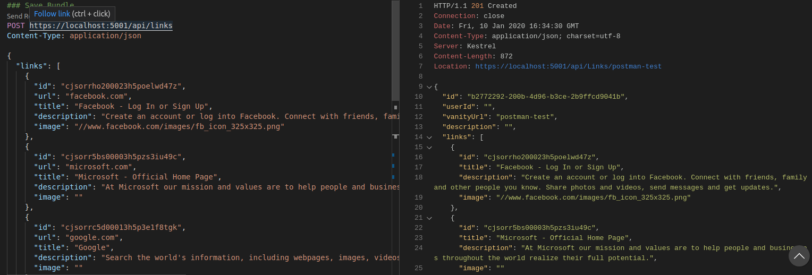

# The Urlist - Backend

[](https://dev.azure.com/dwrdev/Production%20OpenHack/_build?definitionId=205)
[](https://raw.githubusercontent.com/Azure-Samples/openhack-production/master/LICENSE)

The backend for this project was built as a .Net Core API using .NET Core. All the data is stored in a Cosmos DB collection using the SQL API.

- [.NET Core](https://dotnet.microsoft.com)
- [Azure Cosmos DB](https://azure.microsoft.com/services/cosmos-db)

## Build and run the ASP.NET Core backend locally

Copy the contents of the `appsettings.sample.json` into the `appsettings.Development.json` file:

```bash
cp appsettings.sample.json appsettings.Development.json
```

### Get the prerequisites

- Install the [.NET Core 3.1 SDK](https://dotnet.microsoft.com/download). This repo is pinned to use version 3.1.x of the SDK.
- Install [Visual Studio](https://visualstudio.microsoft.com/) or [Visual Studio Code](https://code.visualstudio.com/) or [Visual Studio Community edition](https://visualstudio.microsoft.com/vs)
- Install the [C# extension for Visual Studio Code](https://marketplace.visualstudio.com/items?itemName=ms-vscode.csharp)
- For Windows users, [Windows Subsystem for Linux](https://docs.microsoft.com/en-us/windows/wsl/install-win10)

#### Optional

- Install [Postman](https://www.getpostman.com/)
- Install [REST Client](https://marketplace.visualstudio.com/items?itemName=humao.rest-client)

### Setup Database

[Create a Cosmos DB instance](https://docs.microsoft.com/en-us/azure/cosmos-db/how-to-manage-database-account) in Azure using the SQL API or use the [CosmosDB Emulator](https://docs.microsoft.com/en-us/azure/cosmos-db/local-emulator)

Update the `appsettings.Development.json` file with your Cosmos DB Uri and Primary Key in the `ServiceEndpoint` & `AuthKey` settings respectively. This database will initially be empty. If you try out the API with Postman (see below), the collection and sample documents will be created for you automatically. Otherwise it's structure will be created when you create your first list through the frontend.

### Run from your favorite CLI

Set the `ASPNETCORE_ENVIRONMENT` environment variable.  To 

```bash
export ASPNETCORE_ENVIRONMENT=Development
```

Navigate into backend folder

```bash
cd /api/src/LinkyLink
```

Build the project

```bash
dotnet build
```

Start the API via the command line

```bash
dotnet run
```


Alternatively, start a debuging session in `Visual Studio` or `Visual Studio Code`.


### Run from Visual Studio
From Visual studio choose the startup project as `LinkyLink`.  Then from the debug start menu choose one of the following:

#### IIS Express
Will start the Rest API from an IIS Express instance on a random port.

#### LinkLink
Will start the Rest API from a console app on port `5000` similar to calling `dotnet run` from your favorite CLI.

### Try out the API with Postman

- Start up Postman and import the `theurlist_collection.json` file that's in the `api` folder
- Next import the `theurlist_localhost_env.json` file. That includes the Localhost environment settings.
- Set your environment to `Localhost`
- Turn off Postman SSL Verification


- Run `Save Bundle` to add some data to Cosmos DB. The structure (collection, documents, etc.) in the database will be created for you if it does not exsist yet. Next run `Get bundle for vanity url` to retrieve the entry you just created.


If everything was setup correctly, you should see a response that resembles the following.


### Try out the API using the REST Client extension

- Open the `validate-api.http` file located in the `openhack-production/api` directory
- Follow the instructions in the `Run the ASP.Net Core Web API backend` section of this README to start the backend
- Select `Send Request` for any of the endpoints




### API Documentation

- The API uses [Swagger](https://swagger.io/) for API Documentation.  You can view the swagger documentation by navigating to: `https://localhost:<port>/swagger`


### Misc. Notes

- [Swagger](https://swagger.io/) XML Comments have been enabled to provide better API Documentation.  This means that warnings will be generated for public undocumented public types and members.  By default, this project disables warnings.  Documentation to enable warnings can be found [here](https://docs.microsoft.com/en-us/aspnet/core/tutorials/getting-started-with-swashbuckle?view=aspnetcore-3.1&tabs=visual-studio-code)
