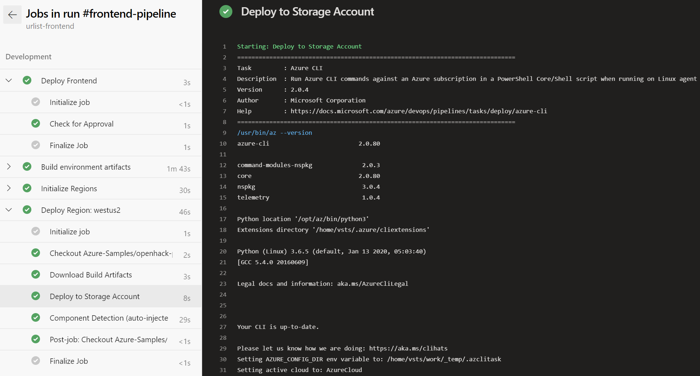
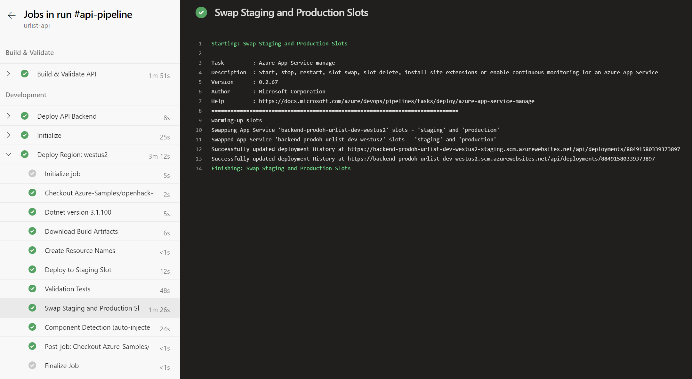

# Application Deployment

The Urlist application leverages [Azure Dev Ops](https://docs.microsoft.com/en-gb/azure/devops/index?view=azure-devops) for work item tracking as well as continuous integration (CI) and continuous deployment (CD).

# Enviroments

The Urlist project uses multiple environments to isolate and test changes before promoting releases to the global user base.

New environment rollouts are automatically triggered based upon a successful deployment of the previous stage /environment.

The **development**, **staging** and **production** environments leverage slot deployment during a environment rollout. After a new release is deployed to a staging slot it is validated through a series of functional integration tests.  Upon a 100% pass rate of all tests the staging & production slots are swapped effectively making updates to the environment available.

Any errors or failed tests halt the deployment in the current stage and prevent changes to further environments.

Mutli-region deployments are handled by the underlying [deployment scripts](scripts.md).  Regions are deployed in parallel within each stage.

Each deployed environment is completely isolated and does not share any components other than Azure AD B2C.  They each have unique resource instances of Azure Frontdoor, Cosmos DB, etc.

## Deployment Dependencies

| Development | Staging | Production |
| --- | --- | --- |
| CI Quality Gates | Development | Staging
|  |  | Manual Approval |

The Urlist product consists of the following environments.

## Local

The local environment is used by individual software engineers during the development of new features and components.

Engineers leverage some components from the deployed development environment that are not available on certain platforms or are unable to run locally.

- CosmosDB
  - Emulator only exists for Windows
- Azure AD B2C
  - Not currently supported in a local development environment

The local environment also does not use Azure Frontdoor or Azure API Management.  The frontend web app directly communicates to the backend REST API typically running on a separate localhost port mapping.

## Development

The development environment is used as the first quality gate.  All code that is checked into the `master` branch is automatically deployed to this environment after all CI quality gates have passed.

### Regions

- West US (westus)

## Staging

The staging environment is used to validate new features, components and other changes prior to production rollout.  This environment is primarily used by developers, QA and other company stake holders.

### Regions

- West US (westus)
- East US (eastus)

## Production

The production environment is used by the worldwide user base.  Changes to this environment are gated by manual approval by your product's leadership team in addition to other automatic quality gates.

### Regions

- West US (westus)
- Central US (centralus)
- East US (eastus)

# Pipelines

3 main pipelines have been created and have been purposely split up to include the application infrastructure, frontend VUE JS app and the backend REST API service.

Each pipeline leverages [multi-stage deployment](https://docs.microsoft.com/en-us/azure/devops/pipelines/process/stages?view=azure-devops&tabs=yaml) where the stage is equivalent to an application environment.  Each environment is also associated with an Azure Dev Ops [variable group](https://docs.microsoft.com/en-us/azure/devops/pipelines/library/variable-groups?view=azure-devops&tabs=yaml).  Variable groups contain specific configuration properties valid for each environment.  They contains items such as database connection strings, dependency urls and more.

The pipelines define the top level stages and dependencies. They are relatively thin and utilize [pipeline templates](https://docs.microsoft.com/en-us/azure/devops/pipelines/process/templates?view=azure-devops). Templates allow us to reuse jobs and/or steps to reduce boilerplate configuration across stages and jobs.

## Infrastructure (deploy-iac)

The infrastructure pipeline handles the deployment of all Azure resources required to run the Urlist application.  The pipeline leverages the [deployment scripts](scripts.md) and [Azure ARM templates](https://docs.microsoft.com/en-us/azure/azure-resource-manager/templates/overview).  Any changes to the ARM templates that is checked into the `master` branch automatically invoke a an incremental deployment update to bring your infrastructure to the desired end state.

## Frontend (urlist-frontend)

The frontend pipelines handles the deployment of the frontend Vue JS static web application. Internally it leverages the Azure CLI to perform a deployment to the configured storage account.

## Backend Rest API (urlist-api)

The backend pipeline handles the deployment of the backend REST API.  The templates leverages [App Service slot deployment](https://docs.microsoft.com/en-us/azure/app-service/deploy-staging-slots) to isolate and validate changes to the environment before it is released.  In addition to environment validation slot deployment pre-warms your application to reduce any latency or downtime occurred during typically deployments.

