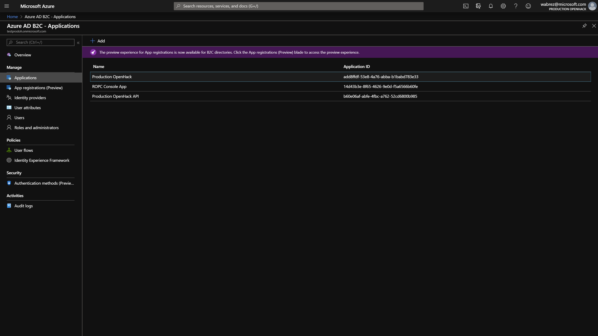
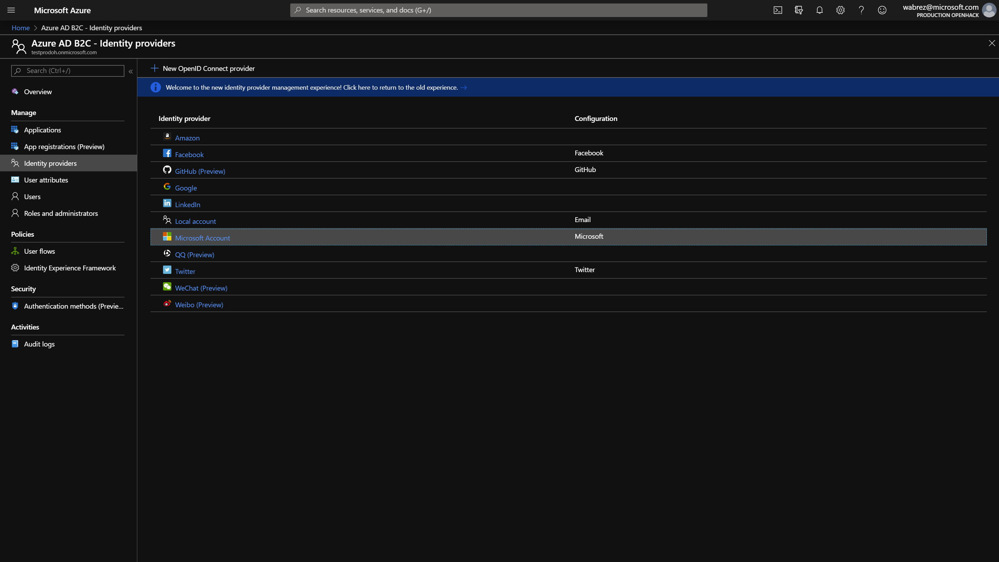
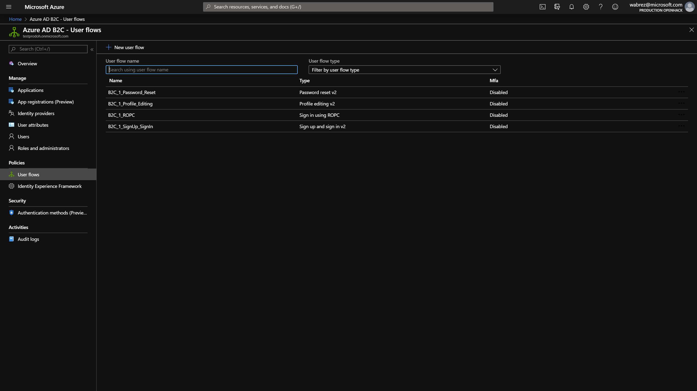
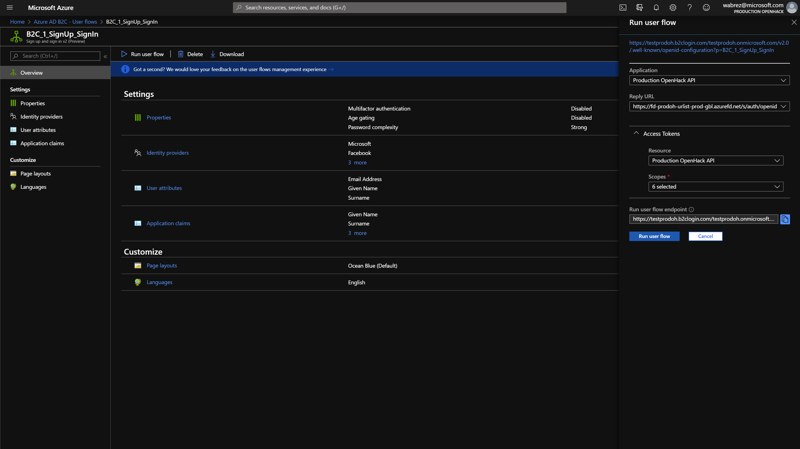
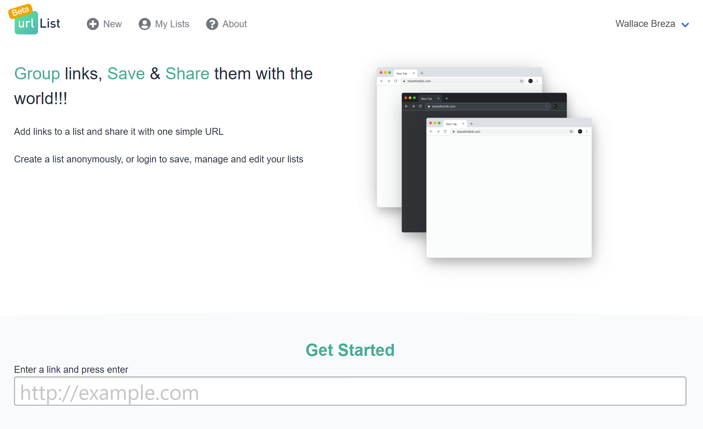

# Overview

[Azure Active Directory B2C](https://docs.microsoft.com/en-us/azure/active-directory-b2c/) (business-to-consumer) is used for custom authentication & authorization across the Urlist application.

- Built on world class-leading Active Directory Identity platform
- Provides easy integration with popular identity providers like Facebook, Twitter, Google & more
- Supports branded registration and sign-in flows for a custom-tailored experience
- Provides many built-in templates to get your solution up and running within minutes

Currently, the Urlist configuration of the Azure AD B2C tenant requires a manual setup process and script automation is not currently supported. Setup requires the configuration of applications, identity providers & user flows.

---

## Table Of Contents

<!-- toc -->

- [Applications](#applications)
- [Identity Providers](#identity-providers)
- [User Flows](#user-flows)
- [Integrating with your application code](#integrating-with-your-application-code)

<!-- tocstop -->

## Applications

Each application within an organization has unique setup requirements and custom authentication constraints.



The following applications are required for the Urlist tenant configuration:

### Production OpenHack API

The primary application used within single sign-on flows from frontend.

#### Configuration

- Allow implicit flow **(true)**
- Native Client **(false)**
- Redirect URIs configured for all application environments
- Scopes
  - UrlBundle.ReadWrite
  - UrlBundle.Delete
  - UrlBundle.Read
  - UrlBundle.ReadAll

### ROPC Console App

This app is used for integration testing and supports Resource owner password credentials (ROPC). You can read more about [ROPC](https://docs.microsoft.com/en-us/azure/active-directory-b2c/configure-ropc?tabs=applications) in the official documentation.

#### Configuration

- Allow implicit flow **(true)**
- Native Client **(true**)
- Redirect URIs
  - urn:ietf:wg:oauth:2.0:oob

---

## Identity Providers

Azure AD B2C supports many popular identity providers out of the box. Additional Identity providers can also be configured as long as it supports OpenID Connect (OIDC).



The Urlist application is currently configured to support the following providers. Each provider has unique configuration requirements. Explore the linked docs below for more information.

1. [Microsoft Account](https://docs.microsoft.com/en-us/azure/active-directory-b2c/identity-provider-microsoft-account) - Microsoft personal accounts
1. [Facebook](https://docs.microsoft.com/en-us/azure/active-directory-b2c/identity-provider-facebook)
1. [GitHub](https://docs.microsoft.com/en-us/azure/active-directory-b2c/identity-provider-github)
1. [Twitter](https://docs.microsoft.com/en-us/azure/active-directory-b2c/identity-provider-twitter)
1. Local Accounts - Custom username/password managed by Azure AD B2C

---

## User Flows

User flows support various common user interactions including sign-in, registration, profile editing, password reset & more. Additionally, they support configuration to customize the user attributes and claims required by your applications for requested id and access tokens.



The Urlist application primarily utilizes a combined sign-in / sign-up flow.

### B2C_1_SignUp_SignIn

This flow is used for the sign-in, sign-up & sign-out experience integrated into the Urlist frontend application

#### Identity Providers

All identity providers listed above are enabled for this user flow.

#### Configuration

Azure AD B2C allows for easy testing by running the user flow from the Azure portal. Click the `Run user flow` button to launch the configuration pane and execute your flow.

Ensure that you configure the following:

1. Application - Choose the application `Production OpenHack API`
1. Reply URL - Point to the endpoint that you are testing
1. Access Tokens
   - Resource: `Production OpenHack API`
   - Scopes: `Select All`



After running through the user flow and signing in with a configured identity provider you will be redirected back to the redirect URL chosen during your configuration. Assuming the frontend application has been configured correctly you should now be logged in with your selected account.



---

## Integrating with your application code

When integrating your applications to leverage Azure AD B2C you will likely be asked for 1 ore more configuration elements. The following configuration elements are commonly used within many applications.

### Tenant Name

The top-level tenant name, typically the first section of your tenant domain.

```text
testprodoh
```

### Tenant Domain

The fully qualified tenant domain hostname.

Example

```text
testprodoh.onmicrosoft.com
```

### ClientID

The client id (GUID) of the application configured within Azure AD B2C.

### Policy ID / User Flow

The name of the policy/user-flow to use.

Example

```text
B2C_1_SignUp_SignIn`
```

### Scopes

One or many fully qualified application scopes. These scopes can be found in the `Published Scopes` or `Expose an API` section of the Azure AD applications.

Example

```text
https://testprodoh.onmicrosoft.com/api/UrlBundle.ReadWrite
```

### Other

Some applications may require concatenating some of the above elements. For example, the full Authority URL is needed to integrate ROPC from a console application to the backend REST API.

Example

```text
https://{TenantName}.b2clogin.com/tfp/{TenantDomain}/{UserFlow}
```

### Open ID Connect (OIDC) Configuration Endpoint

This URL can be found when `Running a user flow` described above at the top of the `Run User Flow` configuration blade. It should look like the following:

```text
https://{TenantName}.b2clogin.com/{TenantDomain}/v2.0/.well-known/openid-configuration?p={UserFlow}
```

Other common configuration elements used within OIDC / OAuth flows are also exposed in the OIDC configuration JSON that is returned from the above URL.

```text
GET https://testprodoh.b2clogin.com/testprodoh.onmicrosoft.com/v2.0/.well-known/openid-configuration?p=B2C_1_SignUp_SignIn
```

JSON Response

```json
{
  "issuer": "https://testprodoh.b2clogin.com/9c3a2992-458b-4d7b-b925-f70a6658e5ba/v2.0/",
  "authorization_endpoint": "https://testprodoh.b2clogin.com/testprodoh.onmicrosoft.com/oauth2/v2.0/authorize?p=b2c_1_signup_signin",
  "token_endpoint": "https://testprodoh.b2clogin.com/testprodoh.onmicrosoft.com/oauth2/v2.0/token?p=b2c_1_signup_signin",
  "end_session_endpoint": "https://testprodoh.b2clogin.com/testprodoh.onmicrosoft.com/oauth2/v2.0/logout?p=b2c_1_signup_signin",
  "jwks_uri": "https://testprodoh.b2clogin.com/testprodoh.onmicrosoft.com/discovery/v2.0/keys?p=b2c_1_signup_signin",
  "response_modes_supported": ["query", "fragment", "form_post"],
  "response_types_supported": [
    "code",
    "code id_token",
    "code token",
    "code id_token token",
    "id_token",
    "id_token token",
    "token",
    "token id_token"
  ],
  "scopes_supported": ["openid"],
  "subject_types_supported": ["pairwise"],
  "id_token_signing_alg_values_supported": ["RS256"],
  "token_endpoint_auth_methods_supported": [
    "client_secret_post",
    "client_secret_basic"
  ],
  "claims_supported": [
    "given_name",
    "family_name",
    "idp",
    "emails",
    "oid",
    "sub",
    "tfp",
    "iss",
    "iat",
    "exp",
    "aud",
    "acr",
    "nonce",
    "auth_time"
  ]
}
```
