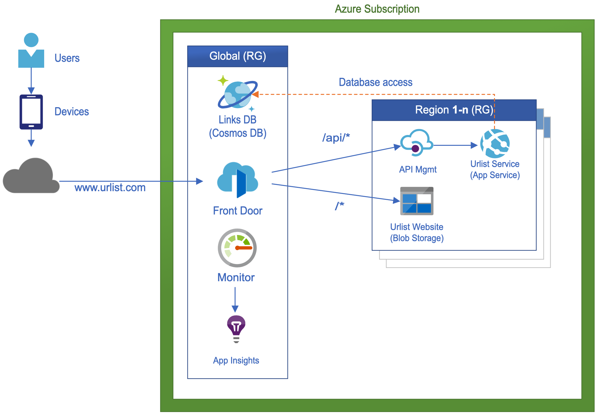

# Infrastructure
The Urlist application is a relativly simple application that uses a robust and scalable infrastructure.  The following demonstrates how using Azure services include Front door, API Management and other PaaS offerings we can quickly and easily deploy a global footprint with fast edge access and global data replication using Cosmos DB.

## Azure Infrastruture

## Naming Conventions
All resources follow a naming convention that ensures unique naming that includes the following components:

- Resource Type
- Business Unit
- Application Name
- Environment (dev | test | prod | etc)
- Region / Location (Multi-region services use **gbl** indicator)

> `${ResourceType}-${BusinessUnit}-${AppName}-${Env}-${Region}`
### Examples

- fd-prodoh-urlist-prod-gbl **(Front Door)**
- rg-prodoh-urlist-prod-westus **(Resource Group)**
- apim-prodoh-urlist-prod-westus **(API Management)**

## Azure FrontDoor
Azure Frontdoor is used to provide a central frontdoor and mesh to all micro-services required for the Urlist application.  It consolidates all url endpoints to a single HTTP entrypoint.  Robust routing rules allow routing traffic to the correct microservice based on request paths.

### Features
- Intelligent routing based on geo-location and latency (edge delivery)
- Single HTTP entry point (ex: www.urlist.com)
- Handles TLS offloading for HTTPS (allows underlying services to use standard HTTP)
- Caching for static content

### Backend Pools
More than one backend is configured for the Urlist application. Backend pools can be configured with different priority or weights based on your business needs.  Each pool also must include a HTTP/HTTPS probe endpoint to monitor a regions health status.  Unhealthy nodes are automatically disabled from the pool.

#### Frontend
The frontend pool uses public endpoints to the static website for each deployed region with equal weighting

#### Backend
The backend pool uses public endpoints to the API Management instance of each deployed region with equal weighting

### Routing Rules
Two routing rules are configured for the Urlist application:

#### Frontend
The frontend route is a wildcard route which matches any other routes not caught.

- Route: `/*`
- Backend Pool: `Frontend`
- Custom Forwarding Path: `None`
- Cachine: `Enabled`

#### Backend
The backend route captures all requiests to the `/api/*` path

- Route: `/api/*`
- Backend Pool: `Backend`
- Custom Forwarding Path: `/`
- Cachine: `Disabled`

## Cosmos DB
Cosmos DB is used as a document level database to store JSON documents for each URL group. When a new region or scale unit is deployed the cosmos db is automatically replicated to new regions without requiring any custom scripts or configuration.

### Features
- Mulit region read/writes
- Single connection string

## API Management
API Management is used to consolidate all APIs under 1 API umbrella.  This allows for the creation of multiple  services potentially developed by different teams with different programming languages that all require adoption of consistent cross cutting concerns like logging, monitoring, authN, authZ, etc.

Today the URList app only contains 1 micro-service but as new features are added can easily expand out to multiple micro-services as needed. With a single micro-service this design can be simplified and remove APIM but we're going to keep it in to demonstrate the example.

### Features
- Consistent Policies
    - Authenication with JWT
    - Custom Headers
    - Throttleing
    - IP allow/block lists

## Monitor & App Insights
Each micro-service it attached to its region's Application Insights cluster for fast recording of requests, page views, custom events and other metrics.

Logs from each app insights cluster is aggregated with Azure Monitor to provide a global view of service KPIs including availability, RPS, latency, etc.  Health checks and alerts can be configured to provide a robust monitoring and observability solution. 

## Azure AD B2C
Azure Active Directory B2C (business-to-consumer) is used for custom authentication & authorization across the Urlist application.

- Built on world class leading Active Directory Identity platform
- Provides easy integration with popular identity providers like Facebook, Twitter, Google & more
- Supports branded registration and sign-in flows for a custom tailored experience
- Provides many built in templates to get your solution up and running within minutes

Detailed information regarding Urlist specific configuration can be found [here](AzureADB2C.md).

