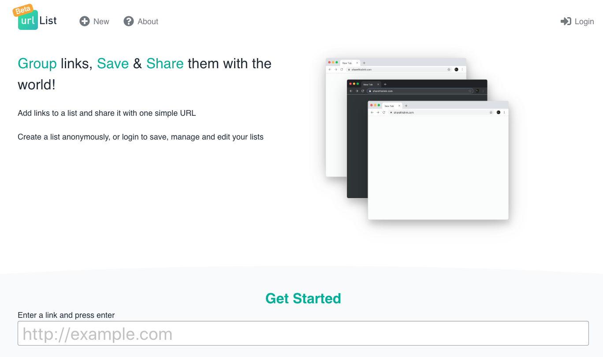
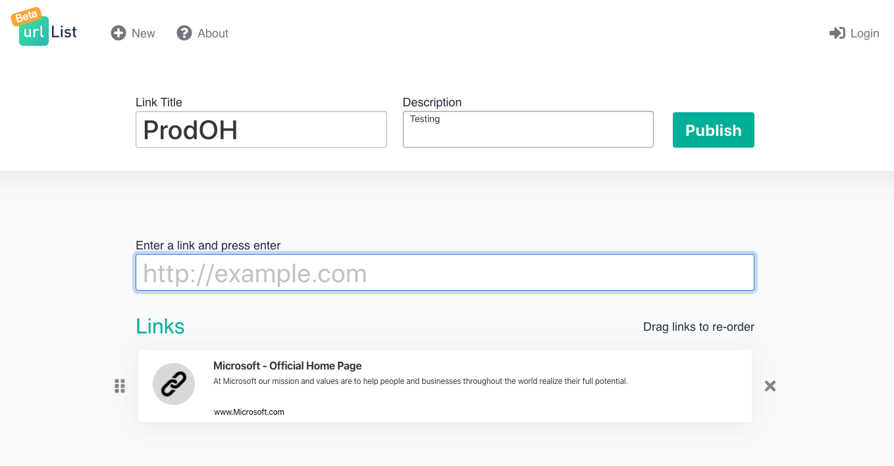
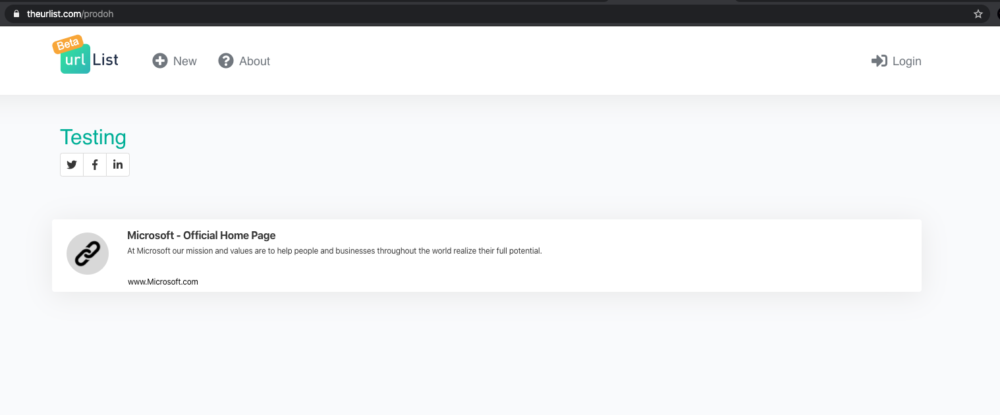
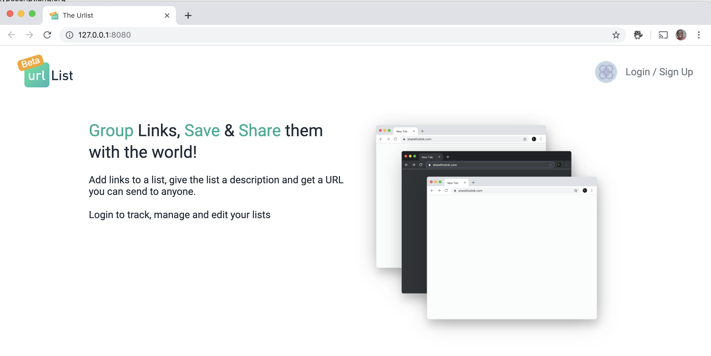
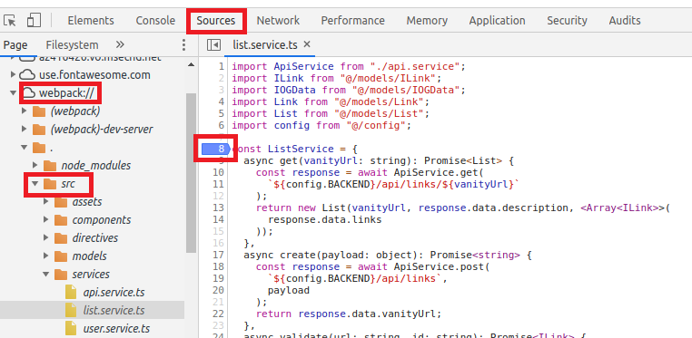

# The Urlist - Frontend

[](https://burkeknowswords.visualstudio.com/The%20Urlist/_build/latest?definitionId=7)

The frontend has the following views:

- **Homepage view**: this is the first page you would see when visiting the frontend. You can start the process of creating a link-bundles from here.

  

- **Edit view**: this is the page where you would create your lists.

  

- **User view**: this page would list all list-bundles created for a signed-in user.

  

- **List view**: this page is used to view the list-bundle for a given vanity URL.

  

The frontend for this project is built with the following libraries and frameworks:

- [TypeScript](https://www.typescriptlang.org/)
- [Vue.js](https://github.com/vuejs/vue) / [Vue CLI](https://github.com/vuejs/vue-cli)
- [Vuelidate](https://github.com/vuelidate/vuelidate)
- [Axios](https://github.com/axios/axios)

Other useful tools

- [Visual Studio Code](https://code.visualstudio.com/?WT.mc_id=theurlist-github-buhollan)
- [Vetur](https://marketplace.visualstudio.com/items?itemName=octref.vetur&WT.mc_id=theurlist-github-buhollan)
- [VS Code Debugger for Chrome](https://marketplace.visualstudio.com/items?itemName=msjsdiag.debugger-for-chrome&WT.mc_id=theurlist-github-buhollan)
- [Vue VS Code Extension Pack](https://marketplace.visualstudio.com/items?itemName=sdras.vue-vscode-extensionpack&WT.mc_id=theurlist-github-buhollan)
- [Vue browser devtools](https://github.com/vuejs/vue-devtools)

## <a name="feconfigs" ></a> Frontend configurations

There are two configurations needed for the frontend to run, those are passed as [VUE environment configs](https://cli.vuejs.org/guide/mode-and-env.html)

- VUE_APP_BACKEND: this has the URL pointing to the backend endpoint.
- VUE_APP_FRONTEND: this has the URL point to the frontend endpoint.
- VUE_APP_OIDC_AUTHORITY: the configured Azure B2C Open ID endpoint.
- VUE_APP_OIDC_CLIENT_ID: the configured Azure B2C Client Application ID.
- VUE_APP_OIDC_SCOPE: the Azure B2C Client Scope.

## Build and run the frontend locally

### Modify VUE environment configs

- Follow the guide on how to run the Backend locally. You can find the README [here](../api/README.md)
- Once the Backend has started, you will want to get the port the Backend uses _(local port may change depending upon the IDE being used)_.
- Follow the authentication setup guide, [here](../docs/AzureADB2C.md), to identify the needed value for the OIDC configurations needed.
- Create a local configuration file called `env.development.local` and add the needed configs as described [above](feconfigs), something like the following:

```bash
VUE_APP_BACKEND=http://localhost:[backend_port]
VUE_APP_FRONTEND=http://localhost:[frontend_port]
VUE_APP_OIDC_AUTHORITY=[Azure B2C Open ID config endpoint]
VUE_APP_OIDC_CLIENT_ID=[Azure B2C Client Application ID]
VUE_APP_OIDC_SCOPE=[Azure B2C Client Scope]
```

### Setup NPM for the frontend

```bash
# Install Vue CLI globally
npm install -g @vue/cli

# Install npm packages for frontend project
npm install
```

### Serve development build

```bash
npm run serve
```



### Create production build

```bash
npm run build
```

_This creates a dist folder under frontend_

### Lints and fixes files

```bash
npm run lint
```

## Debugging the application

- Follow the instructions in the [Build and run the frontend locally](##-build-and-run-the-frontend-locally) to start application
- In Chrome, open the Chrome Developer Tools
- Select `Source` then expand `webpack` then expand the `.` folder then expand `src` and find the TypeScript file that you would like to debug and `double-click` the line in the TypeScript file that you are interested in. See the screenshot below as an example:



# Docker local development

```
docker build -t linkylink-fe .
docker run -it --rm -p 8080:8080 \
-e "VUE_APP_BACKEND=http://localhost:5000" \
-e "VUE_APP_OIDC_AUTHORITY=https://<b2c login subdomain>.onmicrosoft.com/v2.0/.well-known/openid-configuration?p=B2C_1_SignUp_SignIn" \
-e "VUE_APP_OIDC_CLIENT_ID=<client id?" \
-e "VUE_APP_OIDC_SCOPE=openid https://testprodoh.onmicrosoft.com/api/UrlBundle.ReadWrite" \
linkylink-fe
```
