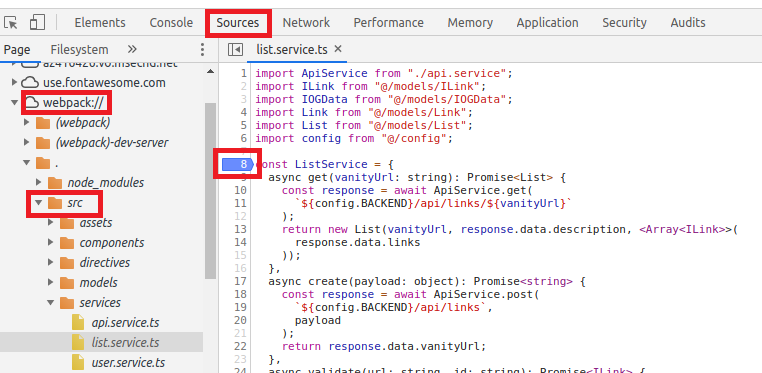

# The Urlist - Frontend
[](https://burkeknowswords.visualstudio.com/The%20Urlist/_build/latest?definitionId=7)

The frontend for this project was build with the following libraries and frameworks:

* [TypeScript](https://www.typescriptlang.org/)
* [Vue.js](https://github.com/vuejs/vue) / [Vue CLI](https://github.com/vuejs/vue-cli)
* [Vuelidate](https://github.com/vuelidate/vuelidate)
* [Axios](https://github.com/axios/axios)

Other useful tools

* [Visual Studio Code](https://code.visualstudio.com/?WT.mc_id=theurlist-github-buhollan)
* [Vetur](https://marketplace.visualstudio.com/items?itemName=octref.vetur&WT.mc_id=theurlist-github-buhollan)
* [VS Code Debugger for Chrome](https://marketplace.visualstudio.com/items?itemName=msjsdiag.debugger-for-chrome&WT.mc_id=theurlist-github-buhollan)
* [Vue VS Code Extension Pack](https://marketplace.visualstudio.com/items?itemName=sdras.vue-vscode-extensionpack&WT.mc_id=theurlist-github-buhollan)
* [Vue browser devtools](https://github.com/vuejs/vue-devtools)

## <a name="feconfigs" ></a> Frontend configurations

There are two configurations needed for the frontend to run, those are passed as [VUE environment variables](https://cli.vuejs.org/guide/mode-and-env.html)

* VUE_APP_BACKEND: this has the URL pointing to the backend endpoint.
* VUE_APP_FRONTEND: this has the URL point to the frontend endpoint.

## Build and run the frontend locally

### Modify Environment Variable

* Follow the guide on how to run the Backend locally.  You can find the README [here](../api/README.md)
* Once the Backend has started, you will want to get the port the Backend uses *(local port may change depending upon the IDE being used)* and modify the `VUE_APP_BACKEND` environment variable value in the `env.development` file.  See below:

```bash
VUE_APP_BACKEND=https://localhost:5001
```

to

```bash
VUE_APP_BACKEND=[scheme_url_port]
```

### Install Vue CLI globally

```bash
npm install -g @vue/cli
```

### Install npm packages for frontend project

```bash
npm install
```

### Serve development build

```bash
npm run serve
```


### Create production build

```bash
npm run build
```

*This creates a dist folder under frontend*

### Lints and fixes files

```bash
npm run lint
```

### Running locally vs running on Azure 

The code is optimised to be run in a local environment. If either the frontend or backend are run on Azure, there is one line of code that needs to be changed:
In \frontend\src\services\api.service.ts change line 19 from 

```bash
axios.defaults.withCredentials = false;
```

to

```bash
axios.defaults.withCredentials = true;
```

This should keep you out of CORS troubles

## Debugging the application

* Follow the instructions in the [Build and run the frontend locally](##-build-and-run-the-frontend-locally) to start application
* In Chrome, press `F12` to start the Chrome Developer Tools
* Select `Source` then expand `webpack` then expand the `.` folder then expand `src` and find the TypeScript file that you would like to debug and `double-click` the line in the TypeScript file that you are interested in.  See the screenshot below as an example:

